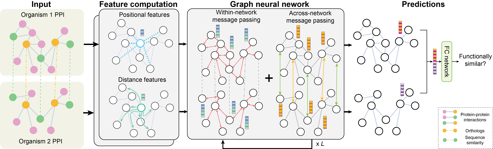

# GraNA
This is the official repository for the paper [**Supervised biological network alignment with graph neural networks**](https://academic.oup.com/bioinformatics/article/39/Supplement_1/i465/7210461) presented at ISMB 2023. **GraNA** is a deep learning framework for supervised biological network alignment (NA). Employing graph neural networks (GNNs), GraNA utilizes within-network interactions and across-network anchor links for learning protein representations and predicting functional correspondence between across-species proteins.



## Table of contents
- [GraNA](#grana)
  - [Table of contents](#table-of-contents)
  - [Install dependencies](#install-dependencies)
  - [Download data](#download-data)
  - [Directories](#directories)
  - [Load data](#load-data)
  - [Train GraNA](#train-grana)
  - [Citation](#citation)
  - [Contact](#contact)

## Install dependencies
```
conda create -n grana python=3.9
conda activate grana
```
We use pytorch 1.12.1 and pytorch-geometrics 2.1.0.post1, which can be installed with the proper version for your cuda following the instructions on their offical website.
```
pip install -r requirements.txt
conda install scipy mkl-service
```


## Download data
In our paper, we use the datasets provided by the authors of ETNA for benchmarking. An example data can be downloaded from https://github.com/ylaboratory/ETNA.


## Directories
Once the data from the above url are downloaded, the file structure can be formulated as follows:
```
.
|-- data
|   |-- emb
|   |-- ortholog
|   |   |-- sce_spo_orthomcl.txt
|   |-- physical_interaction
|   |   |-- sce_physical_pairs.txt
|   |   |-- spo_physical_pairs.txt
|   |--sce_spo
|   |   |--sce_spo_ontology_pairs_expert.txt
|   |--sequence
|   |   |--sce_spo_relabeled.edgelist
|   |--split
|-- code
|   |-- dataset.py
|   |-- load_data.py
|   |-- model.py
|   |-- utils.py
|-- results
|   |--model
|-- LICENSE
|-- README.md
|-- requirements.txt
|-- train.py
```

## Load data
To preprocess the data loaded, run the following:
```
python src/load_data.py
```

## Train GraNA
To train GraNA after loading the data, run the following:
```
python train.py
```

## Citation

>Kerr Ding, Sheng Wang, Yunan Luo, Supervised biological network alignment with graph neural networks, Bioinformatics, Volume 39, Issue Supplement_1, June 2023, Pages i465–i474, https://doi.org/10.1093/bioinformatics/btad241

```
@article{10.1093/bioinformatics/btad241,
    author = {Ding, Kerr and Wang, Sheng and Luo, Yunan},
    title = "{Supervised biological network alignment with graph neural networks}",
    journal = {Bioinformatics},
    volume = {39},
    number = {Supplement_1},
    pages = {i465-i474},
    year = {2023},
    month = {06},
    issn = {1367-4811},
    doi = {10.1093/bioinformatics/btad241}
}
```


## Contact
Please submit GitHub issues or contact Kerr Ding (kerrding[at]gatech[dot]edu) and Yunan Luo (yunan[at]gatech[dot]edu) for any questions related to the source code.